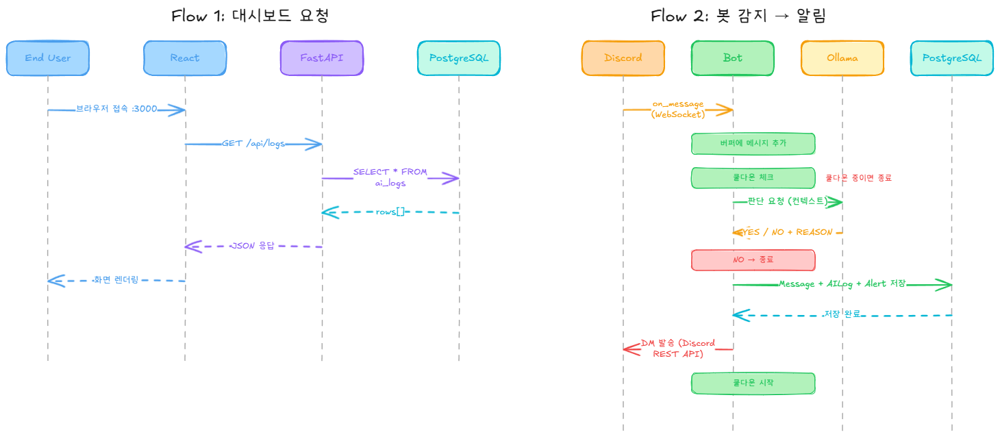

# (가) 프로젝트: Discord Summary

> 좀 필요할 때만 불러라.

## Overview

저는 Discord의 Push 알림을 사용하지 않는 편입니다. 소속되어 있는 Discord 서버에서의 대화, 게임 친구들과의 DM은 일상 메신저인 KakaoTalk에서의 대화들과 분명한 성격 차이가 있기 때문이죠. 그래서 저는 일상과 분리하기 위해 DM의 알림만 허용하고, 서버 내 활동들에 대한 알림은 일절 받지 않습니다. 그러나 mute 처리해 둔 서버에서도 흥미로운 대화나 적당한 답장이 필요한 컨텐츠들이 종종 올라오기 때문에, 이에 대한 알림을 받지 못하는 저로써는 전부 흘려 보내고 한참이 지나서야 확인하게 됩니다.

> 와 도미니카 야구 개잘하네 ㅋㅋ
>
> OO님 이번 패치 보셨어요? 본캐 유기해야 되는 거 아니에여...?

그래서 만들었습니다. 친구들이 나한테 답변을 원하는 것 같으면 알아서 찔러주는 봇을.

---

## How it works

Discord 서버의 메시지를 상시 감지하다가, AI가 "이건 답변이 필요한 것 같다"고 판단하면 카카오톡 DM으로 알림을 보내줍니다. 판단의 근거도 같이요.

```
Discord 서버 메시지 감지
        ↓
최근 30분 대화 컨텍스트 수집
        ↓
AI 판단 (A.X 4.0 Light)
"이거 답변 필요한 거 맞지?"
        ↓  YES일 때만
Discord DM 알림 발송
"💬 #잡담 | 철수: 야 너 어제 그 애니 봤어?"
```

같은 채널에서 30분 내로 중복 알림은 보내지 않습니다. 귀찮으니까요.

---

## Tech Stack

| 분류 | 기술 |
|------|------|
| Bot | discord.py |
| AI | Ollama + A.X 4.0 Light Q4_K_M |
| Backend | FastAPI |
| Frontend | React |
| DB | PostgreSQL |
| Infra | Oracle Cloud Free Tier (ARM) |
| 배포 | Docker + docker-compose |

### 왜 A.X 4.0 Light?

한국어 친구들이랑 한국어로 대화하는 서버를 감시하는 봇입니다. 당연히 한국어를 잘 알아들어야 하죠. SKT가 만든 A.X 4.0 Light는 한국어 벤치마크 KMMLU에서 GPT-4o를 상회하는 성능을 보여줬고, Apache 2.0 라이선스로 자유롭게 쓸 수 있습니다. Q4_K_M으로 양자화하면 4.4GB로 Oracle Free Tier에서도 충분히 돌아갑니다.

### 왜 Oracle Cloud Free Tier?

공짜니까요. ARM 4코어 / 24GB RAM을 영구 무료로 줍니다. CPU 추론이라 응답이 10~20초 걸리지만, 알림 봇 용도에서 20초 딜레이는 크게 문제되지 않습니다.

---

## Architecture

클린 아키텍처를 적용했습니다. 의존성은 항상 안쪽으로만 향합니다.

### System Architecture

> 작성 중

### Sequence Diagram




```
📁 discord_summary/
│
├── 📁 domain/                  # 핵심 비즈니스 (프레임워크 의존 없음)
│   ├── entities/               # Message, AILog, Alert, Feedback
│   └── repositories/           # Repository 인터페이스
│
├── 📁 application/             # 유스케이스
│   ├── judge_message.py        # 메시지 판단
│   ├── send_alert.py           # 알림 발송
│   ├── manage_config.py        # 설정 관리
│   └── get_stats.py            # 통계 조회
│
├── 📁 infrastructure/          # 외부 구현체
│   ├── db/                     # PostgreSQL
│   ├── ollama/                 # Ollama 클라이언트
│   └── discord/                # DM 발송
│
├── 📁 interfaces/              # 진입점
│   ├── api/                    # FastAPI
│   └── bot/                    # discord.py
│
├── 📁 frontend/                # React 대시보드
│
├── 📁 infra/                   # Docker 설정
│   ├── docker-compose.yml
│   └── nginx.conf
│
└── config.yaml
```

---

## Dashboard

AI 판단 품질을 직접 검증할 수 있는 웹 대시보드를 제공합니다.

- **홈**: 오늘 감지된 메시지 수, AI 판단 정확도, 최근 알림 목록
- **감시 설정**: 서버/채널 추가·제거, 쿨다운·버퍼 설정
- **AI 로그**: 판단 이력, 컨텍스트 원문, YES/NO 필터
- **품질 검증**: 판단 결과에 맞음/틀림 피드백, 정확도 통계
- **통계**: 시간대별 메시지 빈도, 채널별 알림 빈도, 응답시간 추이

---

## Getting Started

### Prerequisites

- Docker & docker-compose
- Discord Bot Token
- Discord 계정 User ID

### Run

```bash
cp config.yaml.example config.yaml
# config.yaml 편집 후

docker-compose up -d
```

대시보드: `http://localhost:3000`

---

## Dev Notes

- Oracle Cloud Free Tier는 자원이 자주 부족합니다. 인스턴스 생성이 안 되면 다음 기회에...
- A.X 4.0 Light GGUF는 공식 배포가 없어서 직접 양자화해야 합니다. `docs/`에 변환 가이드를 정리해뒀습니다.
- CPU 추론 기준 응답시간은 10~20초입니다. 알림 봇 용도에서는 허용 범위입니다.
